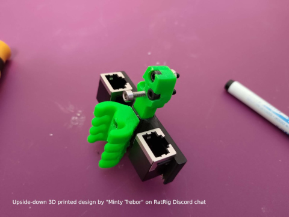

# μ3D: Explanation

### RatRig V-Core 3 EVA wiring over RJ45

A daughter board that mounts on a 3D printer hotend assembly to enable wiring over RJ45.

---

This document provides an explanation of the story behind this PCB module, safety information, and OSHW.

## Menu

  1. [Why another toolboard?](#1-why-another-toolboard)
  2. [Why did you make this?](#2-why-did-you-make-this)
  3. [Safety remarks](#3-safety-remarks)
  4. [Open Source Hardware](#4-open-source-hardware)

---

# 1. Why another toolboard?

There's a multitude of existing toolboards for 3D printers:

  * [Huvud 3D Tool Head](https://hackaday.io/project/174429-huvud-a-3d-printer-tool-head-controller-board)
  * [Voron Afterburner Tool-Head](https://www.onetwo3d.co.uk/product/voron-afterburner-tool-head-pcb/)
  * [Duet Toolboard](https://www.duet3d.com/Duet3Toolboard1LC)
  * [Carabiner PCB](https://github.com/Annex-Engineering/Annex_Engineering_PCBs/blob/master/carabiner-toolboard/buildguide/README.md)
  * [Pi G-Code Hat](https://oshwlab.com/matt_1626/pi-g-code-hat)

They are all great projects, but they are either much more complex, require many difficult to source components, or are simply unavailable / out of stock.

I wanted something designed specifically for the [EVA platform](https://main.eva-3d.page/) and which makes use of ubiquitous RJ45 cables.

# 2. Why did you make this?

Rather than wiring all devices directly from the 3D printer electronics panel to the hotend assembly, this module allows you to connect two simple RJ45 wires between them, and then wire the devices directly using the JST-XH / JST-VH connectors. One module mounts to the hotend, the other mounts on the electronics panel.

It then makes it simple to swap out a hotend without rewiring everything. It significantly cleans up the wiring and reduces maintenance and upgrading headache.

**Note:** This module was originally designed to lay flat with 40x40mm dimensions, but a similar project by _"Minty Trebor"_ on The RatRig Discord chat inspired me to alter the design.

# 3. Safety remarks

**Please use high-end stranded and shielded 24AWG RJ45 cables for safety and reliability.**

**Please use 16AWG stranded wiring for crimping to high current JST-VH connectors.**

Low current PCB traces are 0.5mm and can support at most 1A of current, although RJ45 wires of 26AWG size are rated for 350mA per wire, it is not recommended to pull too much current with such thin wires. The PCB does not contain any fuses or diodes to protect wiring or devices.

High current PCB traces are 3.00mm and can support at most 3.9A of current, and possibly more because the traces are doubled on both sides. **High current traces have only been tested up to 2A. Please be warned and use at your own risk.**

**Do not** connect a thermistor, heater cartridge, or high power fan to the low-current JST-XH/RJ45 connectors. It is only designed for low-current devices and you will have a bad day if you decide to pull more than it can handle.

**Do not** connect anything other than a μ3D module to the RJ45 cables. It does not use any known standard pinouts and will likely destroy any "ethernet" devices you connect (laptops, switches, IP cameras, etc).

**Do** add your own fuses to protect your wiring and devices.

**DISCLAIMER: We are not responsible for accidents or problems caused by your use or misuse of these modules.**

# 4. Open Source Hardware

This project is [certified open hardware](https://certification.oshwa.org/jp000011.html) since August 23, 2021:

If you have the time and patience for it, you're encouraged to generage the Gerbers from the KiCad EDA design files, and have them built by your local PCB fab. We built them through [JLCPCB](https://jlcpcb.com/) based in China.

Under the [CC BY-SA 4.0 License](https://creativecommons.org/licenses/by-sa/4.0/) if you make **changes** or **build upon** to the PCB design or documentation, please share them publicly so everyone may benefit from your improvements.

---

Now that you've read the explanation, feel free to browse the other documents below:

  * [HOWTO](HOWTO.md): more detailed information on testing and wiring patterns
  * [REFERENCE](REFERENCE.md): learn about the pinouts, trace widths, and other technical information
  * [TUTORIALS](TUTORIALS.md): a quick guide to **get started** using this module

# License

μ3D: RatRig V-Core 3 EVA wiring over RJ45 and documentation © 2021 by [Alexander Williams](https://a1w.ca/) is licensed under [_CC BY-SA 4.0_ (Attribution-ShareAlike 4.0 International)](https://creativecommons.org/licenses/by-sa/4.0/).
