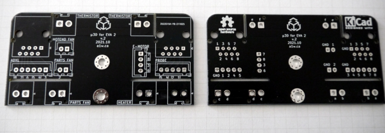

# μ3D: Howto

### RatRig V-Core 3 EVA wiring over RJ45

---

This document provides more detailed information on testing and wiring patterns.

**DISCLAIMER: We are not responsible for accidents or problems caused by your use or misuse of these modules.**

## Menu

  1. [Wiring a PWM fan](#1-wiring-a-pwm-fan)
  2. [Wiring a heater cartridge](#2-wiring-a-heater-cartridge)
  3. [Testing connections](#3-testing-connections)
  4. [Alternate wiring](#4-alternate-wiring)

# 1. Wiring a PWM fan

This PCB module is designed for 2 or 3-wire fans (ground, voltage, PWM signal).

Simple 2-wire fans only require a ground and voltage wire:

* If it's a low-current fan (less than 1A), it should be wired to the small JST-XH connector labeled "HOTEND FAN" (pins 1 and GND) or "PARTS FAN" (pins 2 and GND). Please note a 2-wire fan will be _always on_ (i.e: running 100% all the time).

* If the fan is a high-current fan, the voltage and ground should be wired to the larger JST-VH connector labeled "PARTS FAN" (pins a and b).

A 3-wire fan with a PWM signal should have the PWM signal wired to the smaller JST-XH connector labeled "PARTS FAN" (pin 1), while the voltage and ground should be wired to the larger JST-VH connector labeled "PARTS FAN" (pins a and b).

# 2. Wiring a heater cartridge

The following wiring example is based on a _50W E3D V6_ which has a maximum current draw of 3.9A@12V, 2.8A@24V.

The high-current PCB traces (3.0mm) should theoretically support up to 3.9A of current with a 5deg C temperature rise (tested up to 2A), and the JST-VH connectors can support up to 10A.

Since the JST-VH connector labeled "HEATER" (pins c and d) is not electrically connected to anything else on the PCB, it should be safe to wire the heater cartridge directly to those pins. The heater cartridge wires do not have polarity, so they can be wired to `c` and `d` in any order.

# 3. Testing connections

After soldering all components to the PCB, a good way to ensure there were no mistakes is to perform an electrical continuity test using a multimeter.

One probe should touch a pin on the back of the RJ45 connector, and the other probe should touch the corresponding (numbered) pin on the JST-XH connector. For example: pin 1 on the left RJ45 should match pin 1 on the "HOTEND FAN". It should beep and/or light up to confirm the circuit is closed. Also make sure pin 1 doesn't match with pin 2 or other pins (if it does then you have a short / solder bridge).

For testing the JST-VH connectors, simply place a probe on corresponding (lettered) pins for each device. For example: pin e on the left "THERMISTOR" connector should match pin e on the right "THERMISTOR" connector. It should beep and/or light up to confirm the circuit is closed. Also make sure pin e doesn't match with pin f or other pins (if it does then you have a short / solder bridge).

One final thing to test is connectivity between two PCBs over the RJ45 cables. This should be done _before_ connecting actual devices.

As in the example above, pin 1 on the left RJ45 (on one PCB) should match pin 1 on the left RJ45 (on the other PCB). Do this for all 8 pins on both RJ45 connectors.

Perform a similar test with the wiring between both PCBs over the high-current wires (you're using 16AWG, right?).

---

  * [EXPLAIN](EXPLAIN.md): learn the story behind this PCB, safety information, and OSHW
  * [REFERENCE](REFERENCE.md): learn about the pinouts, trace widths, and other technical information
  * [TUTORIALS](TUTORIALS.md): a quick guide to **get started** using this module

# 4. Alternate wiring

In the situation where you also want to wire an endstop, thermistor, and have PWM control over the parts fans, all through the RJ45 cables, there is an alternate wiring scheme which can be used.

The idea is to use the ADXL pins **after tuning with the automatic [Input Shaper Calibration](https://www.klipper3d.org/Measuring_Resonances.html#input-shaper-auto-calibration)**. The ADXL does not need to be wired permanently, and it won't be used while the thermistor or fans are on (they'll cause too much noise), so it is possible to re-use those pins once calibration is complete.

Simply follow the wiring charts below.

### Alternate 1

**Left side** as viewed from the front:

| Pin number | Label | Device |
| :----: | :---- | :---- |
| a | PARTS FAN (high current) | unused |
| b | PARTS FAN (high current) | unused |
| e | THERMISTOR (high current) | unused |
| f | THERMISTOR (high current) | unused |
| 1 | HOTEND FAN | Hotend fan + |
| - | HOTEND FAN (GND) | Hotend fan - |
| 2 | PARTS FAN | Endstop + |
| - | PARTS FAN (GND) | Endstop - |
| 3 | ADXL (GND) | unused |
| 4 | ADXL | Thermistor |
| 5 | ADXL | Thermistor |
| 6 | ADXL | Endstop signal |
| 7 | ADXL | Parts fan + |
| 8 | ADXL | Parts fan - |

### Alternate 2

**Left side** as viewed from the front:

| Pin number | Label | Device |
| :----: | :---- | :---- |
| a | PARTS FAN (high current) | unused |
| b | PARTS FAN (high current) | unused |
| e | THERMISTOR (high current) | Thermistor |
| f | THERMISTOR (high current) | Thermistor |
| 1 | HOTEND FAN | unused |
| - | HOTEND FAN (GND) | unused |
| 2 | PARTS FAN | Endstop + |
| - | PARTS FAN (GND) | Endstop - |
| 3 | ADXL (GND) | unused |
| 4 | ADXL | Hotend fan + |
| 5 | ADXL | Hotend fan - |
| 6 | ADXL | Endstop signal |
| 7 | ADXL | Parts fan + |
| 8 | ADXL | Parts fan - |

# License

μ3D: RatRig V-Core 3 EVA wiring over RJ45 and documentation © 2021 by [Alexander Williams](https://a1w.ca/) is licensed under [_CC BY-SA 4.0_ (Attribution-ShareAlike 4.0 International)](https://creativecommons.org/licenses/by-sa/4.0/).
