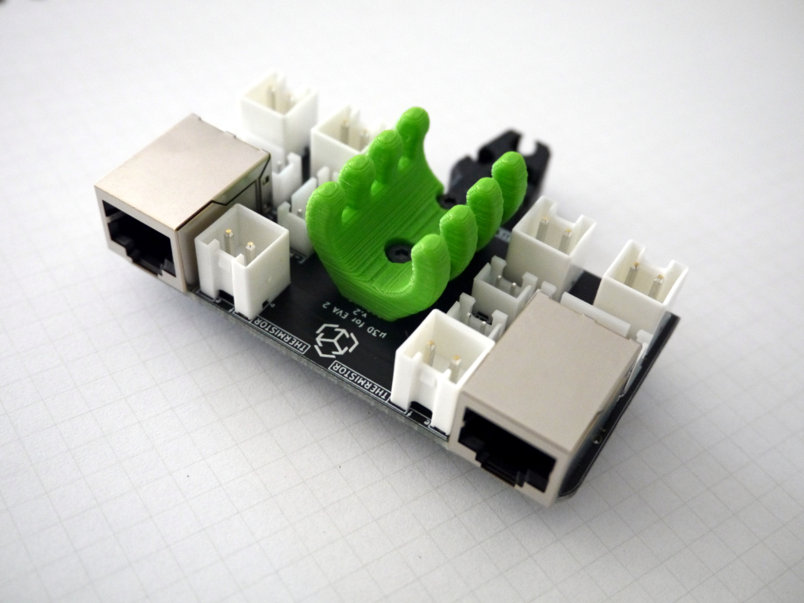

# μ3D: Documentation

### RatRig V-Core 3 EVA wiring over RJ45

A toolboard that mounts on a 3D printer hotend assembly to enable wiring over RJ45.

**DISCLAIMER: We are not responsible for accidents or problems caused by your use or misuse of these modules.**

---

  * [EXPLAIN](EXPLAIN.md): learn the story behind this PCB, safety information, and OSHW
  * [HOWTO](HOWTO.md): more detailed information on testing and wiring patterns
  * [REFERENCE](REFERENCE.md): learn about the pinouts, trace widths, and other technical information
  * [TUTORIALS](TUTORIALS.md): a quick guide to **get started** using this module

# License

μ3D: RatRig V-Core 3 EVA wiring over RJ45 and documentation © 2021 by [Alexander Williams](https://a1w.ca/) is licensed under [_CC BY-SA 4.0_ (Attribution-ShareAlike 4.0 International)](https://creativecommons.org/licenses/by-sa/4.0/).
