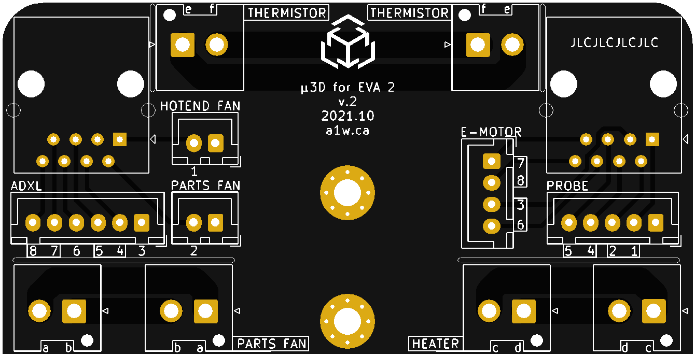
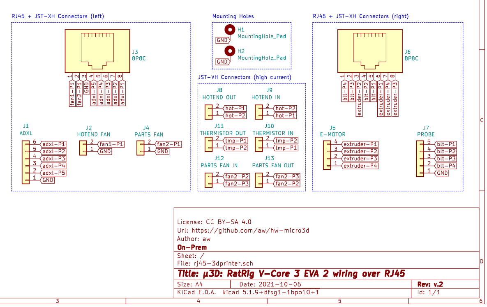

# μ3D: Reference

### RatRig V-Core 3 EVA wiring over RJ45

A daughter board that mounts on a 3D printer hotend assembly to enable wiring over RJ45.

---

This document provides technical information about this module.

**DISCLAIMER: We are not responsible for accidents or problems caused by your use or misuse of these modules.**

## Menu

  1. [Technical specifications](#1-technical-specifications)
  2. [PCB pinout](#2-pcb-pinout)
  3. [Schematic](#3-schematic)
  4. [Bill of materials](#4-bill-of-materials)
  5. [Project logs](#5-project-logs)

---

# 1. Technical specifications

This PCB was designed with [KiCad EDA](https://kicad.org/) v5.1.9 from the `debian buster-backports` repository.

  * Form factor 80mm x 41mm
  * Lead-free, RoHS compliant
  * PCB traces are 0.5mm and can support at most 1A of current
  * High-current PCB traces are 3.0mm and can support at most 3.9A of current (2A tested)
  * High-current PCB traces are doubled on both sides of the PCB (for possibly ~7.8A current - not tested)
  * Grounded M3 mounting holes connected to GND pins
  * [Certified Open Source Hardware](https://certification.oshwa.org/jp000011.html) licensed under [CC BY-SA 4.0](https://creativecommons.org/licenses/by-nc-sa/4.0/)

---

# 2. PCB pinout

Here's a render of the PCB from the front side:

### Pin assigments

**Left side** as viewed from the front:

| Pin number / letter | Device | Type | Twisted pair |
| :----: | :---- | :---- | :---- |
| a | Parts fan | High-current | no |
| b | Parts fan | High-current | no |
| - | Parts fan (GND) | Low-current | no |
| 2 | Parts fan | Low-current | yes (pin 1) |
| | | |
| e | Thermistor | High-current | no |
| f | Thermistor | High-current | no |
| | | |
| - | Hotend fan (GND) | Low-current | no |
| 1 | Hotend fan | Low-current | yes (pin 2) |
| | | |
| 3 | ADXL (GND) | Low-current | yes (pin 6) |
| 4 | ADXL| Low-current | yes (pin 5) |
| 5 | ADXL | Low-current | yes (pin 4) |
| 6 | ADXL | Low-current | yes (pin 3) |
| 7 | ADXL | Low-current | yes (pin 8) |
| 8 | ADXL | Low-current | yes (pin 7) |

**Right side** as viewed from the front:

| Pin number / letter | Device | Type | Twisted pair |
| :----: | :---- | :---- | :---- |
| c | Heater | High-current | no |
| d | Heater | High-current | no |
| | | |
| e | Thermistor | High-current | no |
| f | Thermistor | High-current | no |
| | | |
| - | Probe (GND) | Low-current | no |
| 1 | Probe | Low-current | yes (pin 2) |
| 2 | Probe | Low-current | yes (pin 1) |
| 4 | Probe| Low-current | yes (pin 5) |
| 5 | Probe | Low-current | yes (pin 4) |
| | | |
| 3 | E-Motor | Low-current | yes (pin 6) |
| 6 | E-Motor | Low-current | yes (pin 3) |
| 7 | E-Motor | Low-current | yes (pin 8) |
| 8 | E-Motor | Low-current | yes (pin 7) |

---

# 3. Schematic

A PDF version of the schematic can be [downloaded here](../schematic-v2.pdf)

---

# 4. Bill of materials

Below is the BOM list of through-hole components for one PCB:

| Quantity | Item and Description | Datasheet | Digikey Part # |
| :----: | :---- | :---- | :---- |
| 2 | RJ45/8P8C connector | [Assmann-RJ45-connector.pdf](../datasheets/Assmann-RJ45-connector.pdf) | A-2004-2-4-LP/FS-N-R |
| | | | |
| 2 | 2-pin JST-XH male and female connector (4 pcs) | [JST-XH connector.pdf](../datasheets/JST-XH-connector.pdf) | B2B-XH / XHP-2 |
| 1 | 4-pin JST-XH male and female connector (2 pcs) | | B4B-XH / XHP-4 |
| 1 | 5-pin JST-XH male and female connector (2 pcs) | | B5B-XH / XHP-5 |
| 1 | 6-pin JST-XH male and female connector (2 pcs) | | B6B-XH / XHP-6 |
| 19 | JST-XH socket for crimping | | SXH-001T-P0.6 |
| | | | |
| 6 | 2-pin JST-VH male and female connector (12 pcs) | [JST-VH connector.pdf](../datasheets/JST-V-connector.pdf) | B2P-VH-FB-B |
| 12 | JST-VH socket for crimping | | |

---

# 5. Project logs

This project has been fully documented since its inception. It can be viewed on [Hackaday](https://hackaday.io/project/180918-3d-ratrig-v-core-3-eva-wiring-over-rj45). Care has been taken to document various design decisions and the technical details behind each iteration.

---

Now that you've read the technical reference, feel free to browse the other documents below:

  * [EXPLAIN](EXPLAIN.md): learn the story behind this PCB, safety information, and OSHW
  * [HOWTO](HOWTO.md): more detailed information on testing and wiring patterns
  * [TUTORIALS](TUTORIALS.md): a quick guide to **get started** using this module

# License

μ3D: RatRig V-Core 3 EVA wiring over RJ45 and documentation © 2021 by [Alexander Williams](https://a1w.ca/) is licensed under [_CC BY-SA 4.0_ (Attribution-ShareAlike 4.0 International)](https://creativecommons.org/licenses/by-sa/4.0/).
