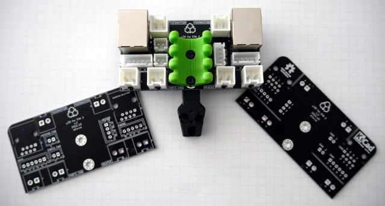
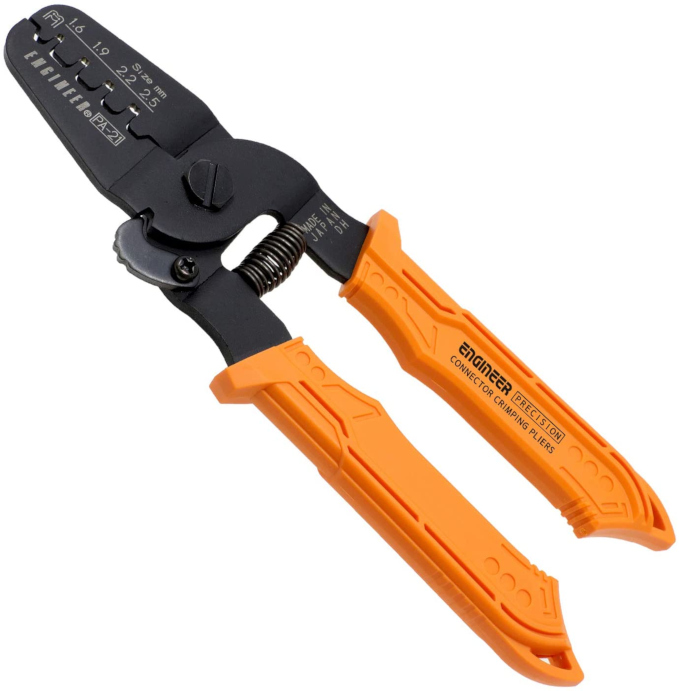

# μ3D: Tutorials

### RatRig V-Core 3 EVA wiring over RJ45

A daughter board that mounts on a 3D printer hotend assembly to enable wiring over RJ45.

---

This document provides a quick guide to **get started** using this module.

**DISCLAIMER: We are not responsible for accidents or problems caused by your use or misuse of these modules.**

## Menu

There are currently **five (5)** starter tutorials.

  1. [Order the PCB kit](#1-order-the-pcb-kit)
  2. [Solder the components](#2-solder-the-components)
  3. [Crimp the connectors](#3-crimp-the-connectors)
  4. [Connect the devices](#4-connect-the-devices)
  5. [Start printing](#5-start-printing)

This PCB and documentation was created by [aw](https://github.com/aw). If you find or have any bugs, issues, or feature requests, please [create an issue](https://github.com/aw/hw-micro3d/issues/new).

You can also join the discussion on channel `#eva-contrib` on the [RatRig Discord](https://discord.gg/n9MrbAq5).

---

# 1. Order the PCB kit

If you haven't purchased the PCB kit already, now's your chance:

[Buy from Tindie](https://www.tindie.com/products/24538/)

 

---

# 2. Solder the components

**Note:** Please use lead-free solder for all components.

**Note:** Before soldering, please ensure there is proper ventilation, and wear a mask or use a fume extractor if possible.

### Test-fit components

Before soldering, test-fit all the JST-XH and JST-VH connectors to confirm their final location and placement. This step is very difficult to get wrong.

### Solder time

1. Start with the smaller JST-XH connectors. Insert all the connectors and cover them with masking tape or
kapton tape so they don’t move, then flip the board and solder them carefully.
2. Solder the larger JST-VH connectors next. Again, cover them with tape so they don't move.
3. Finally, solder the RJ-45 connectors. Insert the RJ-45 connectors then bend the two side pins for stability.

### Verify your work

It's always a good idea to verify each solder connection's continuity with a multimeter, and ensure there are no bridges with nearby pins.

See the [Testing Connections howto](HOWTO.md#3-testing-connections) to learn more about testing the solder connections.

---

# 3. Crimp the connectors

Crimping connectors can be time consuming and error-prone. For the best results, it's recommended to have a **good** crimp tool such as an _Engineer PA-21_ and _Engineer PA-20_ for larger crimps.

Also ensure you have the correct size wires:

* JST-XH crimps support wires 30AWG to 22AWG.
* JST-VH crimps support wires 22AWG to 16AWG.

Lower gauge (ex: 16AWG) can support higher currents compared to higher gauge (ex: 22AWG).

**Note:** Make sure you don't shorten wires too much, leave some room for mistakes and future changes.

The PCB kit includes one extra crimp per PCB. That means you're free to make a mistake, but only one ;)

---

# 4. Connect the devices

### Wire the devices

Wiring devices, such as the thermistor, fans, probe, etc, can be irreversible. If a mistake was made during crimping or soldering, it **could destroy your devices**.

**Note:** Make sure the 3D printer **is off** before connecting devices for the first time.

### Wire the RJ45 cables

Connect the RJ45 cables between the two PCBs.

**Note:** Please use high-end stranded and shielded 24AWG RJ45 cables for safety and reliability.

### Mount the PCBs

Make sure to mount the PCBs to your electronics panel and hotend using the grounded M3 mounting holes.

Congratulations! If you've made it this far, then you're almost ready to start 3D printing.

---

# 5. Start printing

Turn on your 3D printer, and make some final verifications:

### Verify temperatures

Ensure the wires and cabling aren't getting hot. They should not feel hot after simply turning on the printer. If they do, you might have incorrect wiring and this **could be dangerous**.

### Verify voltages

Ensure the voltages to each device are correct (ex: 24V for the thermistor, 12V for the fan, etc).

### Make a test print

Make a test print, while checking the temperatures of all wiring during printing. Everything should feel _normal_. Smoke is a bad sign, fire is a really bad sign. It's a good idea to avoid those.

See the [Safety remarks explanation](EXPLAIN.md#3-safety-remarks) to read more safety recommendations.

---

Now that you've completed all the tutorials, you're ready to read the other documents below:

  * [EXPLAIN](EXPLAIN.md): learn the story behind this PCB, safety information, and OSHW
  * [HOWTO](HOWTO.md): more detailed information on testing and wiring patterns
  * [REFERENCE](REFERENCE.md): learn about the pinouts, trace widths, and other technical information

# License

μ3D: RatRig V-Core 3 EVA wiring over RJ45 and documentation © 2021 by [Alexander Williams](https://a1w.ca/) is licensed under [_CC BY-SA 4.0_ (Attribution-ShareAlike 4.0 International)](https://creativecommons.org/licenses/by-sa/4.0/).
